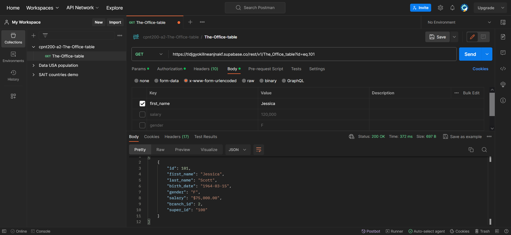

# cpnt200-a2-Import-Data-into-Supabase

## Author: Chad Cervantes

### Attributions 

- [Adding images to README.md in GitHub](https://www.educative.io/answers/adding-images-to-readmemd-in-github)

### Query 1 - patch_first_name_of_id_101

### Query 2 - patch_gender_of_id_101

### Query 3 -  patch_last_name_of_id_100

### Query 4 - patch_salary_of_id_100

